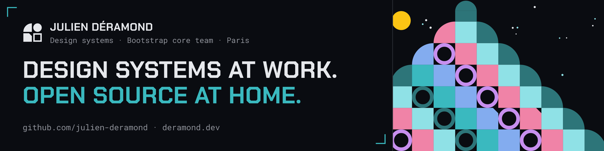

  <picture>
    <source srcset=".github/header.svg" type="image/svg+xml">
    
  </picture>

Julien Déramond builds open source tools for design systems, such as component-anatomy, dtgraph and bootstrap-tokens, has been on the Bootstrap core team since 2022, and contributes upstream to many front-end open source projects. Julien created Open {re}Source and Advent of Open Source to help people discover and contribute to open source, and works as a Design System Tech Lead at Thales. Based in Paris.

  
  
  
  
  

## Open source tools

- [Component Anatomy](https://github.com/julien-deramond/component-anatomy) — Framework-agnostic interactive component anatomy for design system docs — annotate the DOM, get synced hover highlights
- [dtgraph](https://github.com/julien-deramond/dtgraph) — Interactive dependency graph for DTCG design tokens: visualize aliasing, blast radius, and cycles as a design system grows
- [Bootstrap Tokens](https://github.com/julien-deramond/bootstrap-tokens) — Bootstrap 6's design system as portable design tokens, and a visual theme builder that writes them
- [transtyle](https://github.com/transtyle/transtyle) — A compiler for design systems — describe yours once as W3C design tokens, compile native themes for eight ecosystems (Bootstrap, shadcn/ui, daisyUI, ECharts, Storybook, Radix, PrimeNG, CSS variables). Deterministic, explainable, zero runtime
- [Bootstrap Deprecated Classes Extension](https://github.com/julien-deramond/bootstrap-deprecated-classes-extension) — Browser extension highlighting Bootstrap deprecated classes in websites
- [update-issue-body](https://github.com/julien-deramond/update-issue-body) — GitHub action to update the issue's body
- [sponsorkit-starter](https://github.com/Open-reSource/sponsorkit-starter) — GitHub template repository for [SponsorKit](https://github.com/antfu/sponsorkit/) toolkit for automatically generating sponsors images from GitHub Sponsors

## Bootstrap

[Bootstrap](https://getbootstrap.com/) Core Team Member since 2022. [Bootstrap](https://getbootstrap.com/) Contributor since 2021.

  
List of OSS repositories (3)

  - https://github.com/twbs/bootstrap
  - https://github.com/twbs/examples
  - https://github.com/twbs/blog

## Community

Creator of [Open {re}Source](https://openresource.dev) and [Advent of Open Source](https://adventofopensource.com/).

  
List of OSS repositories (6)

  - https://github.com/Open-reSource/openresource.dev
  - https://github.com/Open-reSource/adventofopensource.com
  - https://github.com/Open-reSource/sponsorkit-starter
  - https://github.com/Open-reSource/labs-we-don-t-assign-issues
  - https://github.com/Open-reSource/labs-append-markdown-to-issues
  - https://github.com/Open-reSource/slidev-theme-linkedin-carousel

## Talks and appearances

[Talks at conferences or meetups](https://github.com/julien-deramond/talks):

- [Open Source Experience](https://www.opensource-experience.com/) — [Design Systems : stratégies Inner & Open Source](https://github.com/julien-deramond/talks/blob/main/osxp2025/README.md) (in French)
- [DesignOps Meetup #17 : Design System : et si on devait tout refaire ?](https://www.youtube.com/watch?v=GI_ZqjSUhng) (in French)
- [Storybook Paris #3 - What's your status](https://www.youtube.com/watch?v=8XSjQVoTT6o) — [Hunt Down Deprecated Classes from Your Browser](https://github.com/julien-deramond/talks/blob/main/storybook-paris-3/README.md)
- [OW2con'24](https://www.ow2con.org/view/2024/) — [Orange Open-Source Design System and Its Bootstrap Fork](https://github.com/julien-deramond/talks/blob/main/ow2con24/README.md)

On YouTube:

- [Open Source Experience — Design Systems : stratégies Inner & Open Source](https://www.youtube.com/watch?v=SOPWseO4VkI) (in French)
- [DesignOps Meetup #17 : Design System : et si on devait tout refaire ?](https://www.youtube.com/watch?v=GI_ZqjSUhng) (in French)
- [Storybook Paris meetup #3](https://www.youtube.com/live/8XSjQVoTT6o?si=nbNsZZZ-o2VI28bF&t=3287) by Chromatic
- [Navigating the Open Source Galaxy with Julien Déramond: Bootstrap Core Team Member](https://www.youtube.com/watch?v=_rLnGq34q74) by Uriel Ofir (Ma'akaf Community Interview Series)
- [Webinaire "Design system et accessibilité numérique"](https://www.youtube.com/watch?v=aL07Iv1KCMk) by Manifeste Inclusion (in French)
- [State of CSS Frameworks](https://www.youtube.com/watch?v=twc-iF40TJY) by This Dot Media

In articles:

- [Frontguys | Les Design Systems au cœur des grandes organisations : Orange, Engie, Thales, Airbus et Accor](https://frontguys.fr/design-system/les-design-systems-au-coeur-dorange-engie-thales-airbus-et-accor/) (in French)

## Work

**[Thales](https://www.thalesgroup.com)**, since 2025. Software tech lead in Paris, France. Tech lead of [Quantum Design System](https://quantum.thalesdigital.io/).

**[Orange](https://orange.com)**, 2008–2025, around 16 years. Front-end software engineer. Tech Lead of [Orange Design System](https://system.design.orange.com), Lead Dev of its web framework, [Boosted](https://boosted.orange.com/). Contributor to and/or maintainer of several Orange open source projects. Before that: embedded development in Qt/QML for Set-Top Boxes (STBs), and a bunch of C/C++ Web Services as Apache Modules.

  
List of OSS repositories (12)

  - https://github.com/Orange-OpenSource/Orange-Boosted-Bootstrap/
  - https://github.com/orange-OpenSource/ods-charts
  - https://github.com/Orange-OpenSource/IOT-Map-Component
  - https://github.com/Orange-OpenSource/ods-ios
  - https://github.com/Orange-OpenSource/ods-android
  - https://github.com/Orange-OpenSource/ods-flutter
  - https://github.com/Orange-OpenSource/ouds-ios
  - https://github.com/Orange-OpenSource/ouds-android
  - https://github.com/Orange-OpenSource/ods-storybook-theme
  - https://github.com/Orange-OpenSource/ods-jekyll-theme
  - https://github.com/Orange-OpenSource/ods-mkdocs-theme
  - https://github.com/Orange-OpenSource/qmljsreformatter

## Stats

  
  

## Sponsors

  

  

<!--
Great repo to improve this README file: https://github.com/abhisheknaiidu/awesome-github-profile-readme
-->

<!--
Count visitors badge:
  
-->
