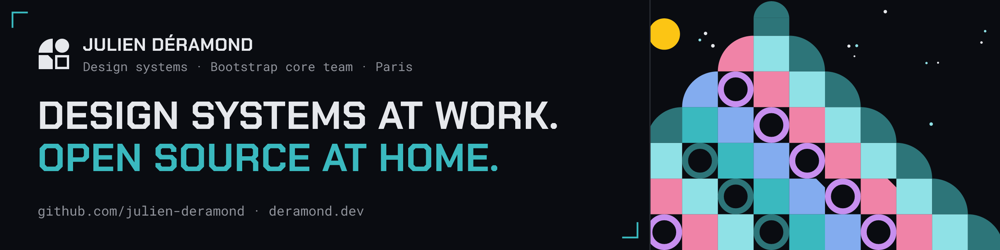

  <picture>
    <source srcset=".github/header.svg" type="image/svg+xml">
    
  </picture>

Open source tools for design systems and upstream contributions. [Bootstrap](https://getbootstrap.com/) core team. Creator of [Open {re}Source](https://openresource.dev/). Design System Tech Lead at Thales.

  
  
  
  
  

## More on deramond.dev

[deramond.dev](https://deramond.dev/) tells the full story:

- [Projects](https://deramond.dev/projects/): Component Anatomy, dtgraph, Bootstrap Tokens, Transtyle, Bootstrap, Open {re}Source, Advent of Open Source and smaller tools.
- [Talks](https://deramond.dev/talks/): conference sessions with their slides, and video appearances.
- [CV](https://deramond.dev/cv/): design systems at Thales and Orange, with a printable PDF.
- [Blog](https://deramond.dev/blog/): posts on design systems, open source maintenance and tooling.

## Stats

  
  

## Sponsors

  

  

